# POS-Semesterprojekt 2024: Einkaufsliste - Luca Jenerwein
Die Software für eine einfache Verwaltung einer Einkaufsliste wurde im Zuge des POS-Semesterprojektes von Luca Jenerwein durchgeführt. 

<br>

## Softwarearchitektur
Die Software besteht aus 2 Clients, einem Server und einer Datenbank. Der Server, welcher auf Spring Boot basiert, bildet die Basis zur Kommunikation zwischen den Clients und der eingebundenen MongoDB-Datenbank. Ein Client wurde mit C# und WPF entwickelt. Der andere wurde direkt in das Spring Boot Projekt eingebunden und mit HTML, CSS und JavaScript umgesetzt. 

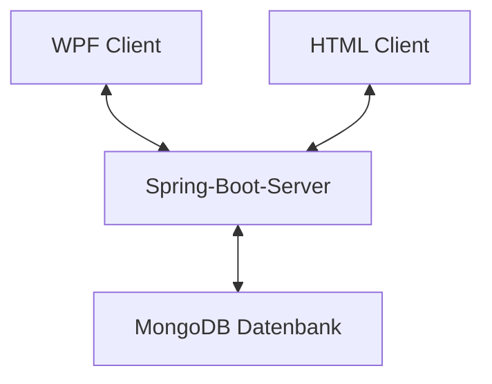

<br>

## Softwarebeschreibung
Die Einkaufszettel-App bietet sowohl eine Desktop-Anwendung als auch eine webbasierte Benutzeroberfläche für die Verwaltung der Einkaufsliste. Es ermöglicht Benutzern, neue Produkte hinzuzufügen, vorhandene Produkte zu bearbeiten oder zu löschen sowie den Status der Produkte zu aktualisieren (abzuhaken). <br> Die Kommunikation mit dem Server erfolgt über eine RESTful-API. Dieser empfängt Anfragen von den Clients, verarbeitet sie und aktualisiert entsprechend die Datenbank.

<br>

## Funktionen der Web-App
Um auf die Web-App zu gelangen, muss der Spring-Boot Server gestartet sein. Mit folgender Eingabe im Browser gelangen wir zu unserem Web-basierten Einkaufszettel.
 ```text
    "http://localhost:8080"
  ```
 

### Produkt zur Einkaufsliste hinzufügen
 <br>
Im Textfeld erfolgt die Eingabe des Produkts, welches man einkaufen muss.

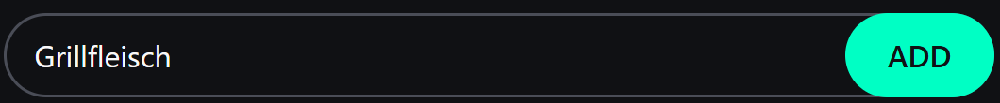 <br>
Nach der Eingabe ist der ADD-Button oder die ENTER-Taste zu betätigen.

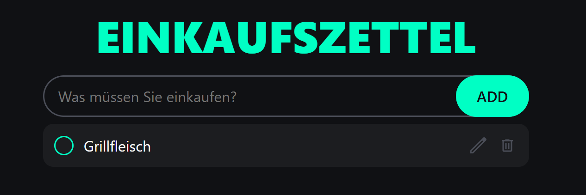 <br>
Nun erscheint das eingegebene Produkt in unserer Einkaufsliste. In der Datenbank wurde es ebenfalls gespeichert. Falls schon Produkte in der Datenbank gespeichert sind, werden diese natürlich am Anfang auch geladen und angezeigt.

### Produkt bearbeiten
Mit Klick auf das Edit-Symbol kann man das vorhandene Produkt bearbeiten.


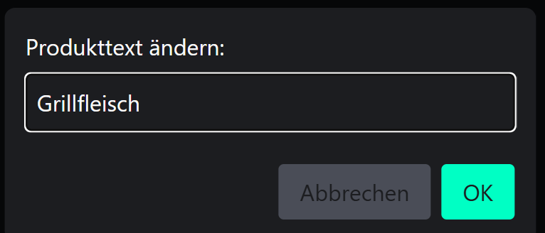 <br>
Es öffnet sich ein eigener Dialog, in dem man den Produkttext nun anpassen kann.

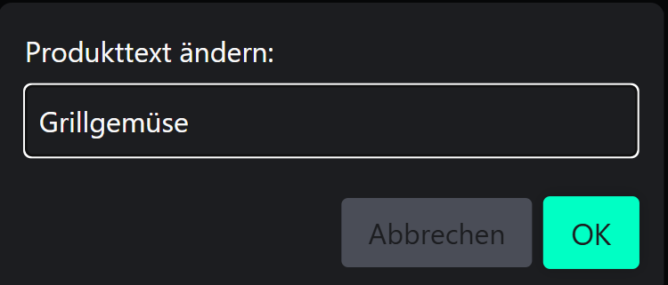 <br>
Nach der Eingabe des neuen Textes ist der OK-Button zu betätigen. Beim Abbruch-Button kehrt man einfach wieder zur ursprünglichen Einkaufsliste zurück, ohne Veränderung.

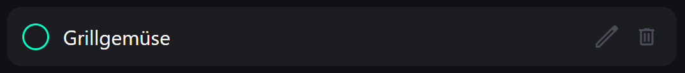 <br>
Das Produkt wurde nun erfolgreich geändert und auf der Oberfläche sowie in der Datenbank aktualisiert.

### Produkt abhaken
Wenn man das Produkt nun erfolgreich im Supermarkt erworben hat, kann man es mithilfe der grünen Checkbox abhaken:


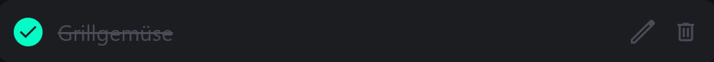 <br>
Die Checkbox wird nun ausgefüllt, der Text durchgestrichen und der Status des Produktes in der Datenbank aktualisiert.

### Produkt löschen
Wenn man das Produkt, welches man vorher aufgeschrieben hat, nun doch nicht mehr benötigt, kann man es über den Delete-Button entfernen.

 <br>
Durch das Betätigen dieses Buttons wird das Element sowohl auf der Oberfläche als auch in der Datenbank gelöscht.

<br>

## Funktionen der WPF-Anwendung
Die WPF Anwendung bietet im Großen und Ganzen die gleichen Funktionen wie die Web-App. 

### Produkt zur Einkaufsliste hinzufügen
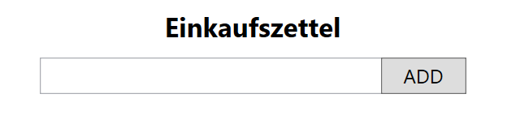 <br>
Im Textfeld erfolgt die Eingabe des Produkts, welches man einkaufen muss.

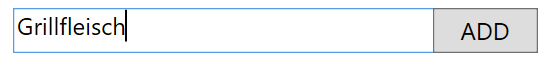 <br>
Nach der Eingabe ist der ADD-Button zu betätigen.

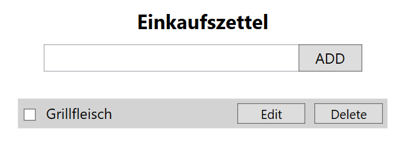
Nun erscheint das eingegebene Produkt in unserer Einkaufsliste. In der Datenbank wurde es ebenfalls gespeichert. Falls schon Produkte in der Datenbank gespeichert sind, werden diese natürlich am Anfang auch geladen und angezeigt.

### Produkt bearbeiten
Mit Klick auf den Edit-Button kann man das vorhandene Produkt bearbeiten.

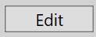

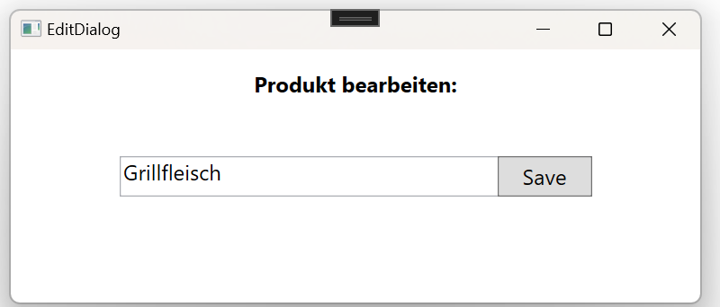 <br> 
Es öffnet sich ein eigener Dialog, in dem man den Produkttext nun anpassen kann.

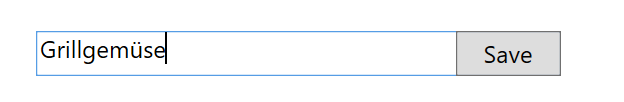 <br>
Nach der Eingabe des neuen Textes ist der Save-Button zu betätigen. Beim Schliessen des Dialogs kehrt man einfach wieder zur ursprünglichen Einkaufsliste zurück, ohne Veränderung.

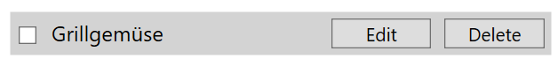 <br>
Das Produkt wurde nun erfolgreich geändert und auf der Oberfläche sowie in der Datenbank aktualisiert.

### Produkt abhaken
Wenn man das Produkt nun erfolgreich im Supermarkt erworben hat, kann man es mithilfe der Checkbox abhaken:


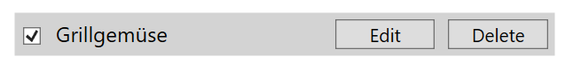 <br>
Die Checkbox wird nun ausgefüllt und der Status des Produktes in der Datenbank aktualisiert.

### Produkt löschen
Wenn man das Produkt, welches man vorher aufgeschrieben hat, nun doch nicht mehr benötigt, kann man es über den Delete-Button entfernen.

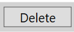 <br>
Durch das Betätigen dieses Buttons wird das Element sowohl auf der Oberfläche als auch in der Datenbank gelöscht.

<br>

## Beschreibung API
Der Spring-Boot-Server basiert auf dem REST-Prinzip und stellt GET-, POST-, PUT- und DELETE-Endpunkte bereit. Diese Endpunkte ermöglichen es den Clients, mit dem Server und somit auch mit der Datenbank zu kommunizieren.

### Endpunkte:

Vor jedem Endpunkt wird "IP-Adresse:PORT" ergänzt, in unserem Fall:
```text
  "localhost:8080"
```

<details>
  <summary>/api/produkte [GET]</summary>
  
  **Beschreibung:** Dieser Endpunkt wird verwendet, um alle Produkte aus der Datenbank auszulesen.
  
  **JSON-Body:**
  /
  
  **Return-Wert:**
  ```json
  {
      "id": "665d021f9e7a11560d4d0ce0",
      "status": false,
      "produkt": "Grillfleisch"
  },
  {
      "id": "665d02379e7a11560d4d0ce2",
      "status": false,
      "produkt": "Grillgemüse"
  }
  ```
</details>

<details>
  <summary>/api/produkt [POST]</summary>
  
  **Beschreibung:** Dieser Endpunkt wird verwendet, um ein Produkt zur Datenbank hinzuzufügen.
  
  **JSON-Body:**
  ```json
  {
    "produkt": "Grillfleisch"
  }
  ```
  
  **Return-Wert:**
  ```json
  {
    "id": "665d03849e7a11560d4d0ce4",
    "status": false,
    "produkt": "Grillfleisch"
  }
  ```
</details>

<details>
  <summary>/api/produkt [PUT]</summary>
  
  **Beschreibung:** Dieser Endpunkt wird verwendet, um ein Produkt, welches bereits in der Datenbank gespeichert ist, zu verändern.
  
  **JSON-Body:**
  ```json
  {
    "id": "665d03849e7a11560d4d0ce4",
    "status": true,
    "produkt": "Grillfleisch"
  }
  ```
  
  **Return-Wert:**
  ```json
  {
    "id": "665d03849e7a11560d4d0ce4",
    "status": true,
    "produkt": "Grillgemüse"
  }
  ```
</details>

<details>
  <summary>/api/produkt/{id} [DELETE]</summary>
  
  **Beschreibung:** Dieser Endpunkt wird verwendet, um ein Produkt, welches  in der Datenbank gespeichert ist, zu löschen.
  
  **JSON-Body:**
  /

  Die ID des Produkts, welches man löschen will, muss man am Pfad anhängen: 
  
```text
  "localhost:8080/api/produkt/665d03849e7a11560d4d0ce4"
```
  
  **Return-Wert:** <br>
 Wenn erfolgreich --> Status 200 --> OK <br>
Ansonsten --> Status 500 --> Internal Server Error

</details>

<br>

## Verwendung der API
Im Folgenden wird zum Verständnis die Implementierung der GET-Abfrage genau erklärt.

<details>
  <Summary>MongoDB-Datenbank</summary>

  **Beschreibung:** Gespeicherte Produkte in der MongoDB Datenbank.

  **MongoDB:**
  ```json
  {
    "id": "665d021f9e7a11560d4d0ce0",
    "status": false,
    "produkt": "Grillfleisch"
  },
  {
    "id": "665d02379e7a11560d4d0ce2",
    "status": false,
    "produkt": "Grillgemüse"
  }
  ```
</details>

<details>
  <Summary>Spring-Boot Server</summary>

  **Beschreibung:** Endpoint Spring-Boot Server

  **Java-Endpoint:**
  ```java
    @GetMapping("produkte")
    public List<ProduktDTO> getProdukte() {
        return produktService.findAll();
    }
  ```

  Über diesen Endpoint werden alle Produkte aus der Datenbank ausgelesen.

  **ProduktEntity:**
  ```java
    public ProduktEntity(ObjectId id, Boolean isChecked, String produkt) 
    {
        this.id = id;
        this.status = isChecked;
        this.produkt = produkt;
    }
  ```
</details>

<details>
  <Summary>WPF-Client</summary>

  **Beschreibung:** GET-Abfrage vom WPF-Client aus (Produkte abfragen)

  **C#-Code:**
  ```csharp
    private async void LoadProdukte()
    {
        try
        {
            //alle Produkte aus der Datenbank lesen
            HttpClient client = new HttpClient();
            HttpResponseMessage response = await client.GetAsync("http://localhost:8080/api/produkte");
            if (response.IsSuccessStatusCode)
            {
                //in Observable Collection speichern
                string json = await response.Content.ReadAsStringAsync();
                var produktList = JsonSerializer.Deserialize<ObservableCollection<Produkt>>(json);
                foreach (var produkt in produktList)
                {
                    produkts.Add(produkt);
                }
            }
        }
        catch (Exception ex)
        {
            MessageBox.Show($"Fehler beim Laden der Produkte: {ex.Message}");
        }
    }
  ```

  Die Methode LoadProdukte lädt asynchron alle Produkte aus der Datenbank, indem sie eine HTTP-GET-Anfrage an den Server sendet. Wenn die Anfrage erfolgreich ist, wird die Antwort in eine JSON-Zeichenkette konvertiert und anschließend in eine ObservableCollection deserialisiert. Bei einem Fehler während des Vorgangs wird eine Fehlermeldung angezeigt.

</details>

<details>
  <Summary>WebApp-Client</summary>

  **Beschreibung:** Login von dem WebApp-Client aus

  **JS-Code:**
 ```js
    async function getDatenFromMongoDB() {
    try {
        //alle Produkte aus der Datenbank lesen und in allProdukte speichern
        const response = await fetch('/api/produkte');
        if (!response.ok) {
            throw new Error('Fehler beim Abrufen der Daten');
        }
        allProdukte = await response.json();
    }
    catch (error) {
        console.error('Fehler beim Abrufen der Daten:', error);
        throw error;
    }
}
  ```

  Die Funktion getDatenFromMongoDB ruft asynchron alle Produkte aus der Datenbank ab, indem sie eine GET-Anfrage an den Endpunkt /api/produkte sendet. Wenn die Anfrage erfolgreich ist, wird die Antwort in der Liste allProdukte gespeichert. Falls ein Fehler auftritt, wird dieser im auf der Konsole ausgegeben und ein Error geworfen.

</details>

## Diskussion der Ergebnisse

Im ersten Release wird die erste Version der Einkaufslisten-App vorgestellt. Die App kann sowohl als eigenständiges Programm auf dem PC als auch in jedem beliebigen Browser genutzt werden. Diese Lösung bietet in beiden Varianten eine ansprechende und intuitive Benutzeroberfläche, um eine einfache Bedienung zu gewährleisten. Die App basiert im Hintergrund auf einem Spring-Boot-Server, der für die Verwaltung und Integration einer MongoDB-Datenbank verantwortlich ist. Benutzer können Einkaufslisten erstellen, ändern und löschen. Jede Änderung wird sofort in der Datenbank gespeichert und kann somit nicht verloren gehen.

### Zusammenfassung
Die Einkaufslisten-App bietet eine ansprechende Benutzeroberfläche für mehrere Plattformen. Durch den Spring-Boot-Server im Hintergrund wird eine ständige Synchronisation zwischen der Datenbank und den Clients ermöglicht.

### Hintergründe
Bei der Entwicklung dieser Einkaufslisten-App wurde der Fokus auf eine benutzerfreundliche und einfache Bedienung gelegt, um dem Benutzer das Verwalten seiner Einkäufe mühelos zu ermöglichen. Durch die verwendeten Technologien (C#, JavaScript, Spring-Boot, HTML, CSS, JavaScript, JSON, MongoDB) wird auch in Zukunft ein reibungsloser Betrieb gewährleistet.

## Diagramme

### Architekturdiagramm


### Sequenzdiagramm
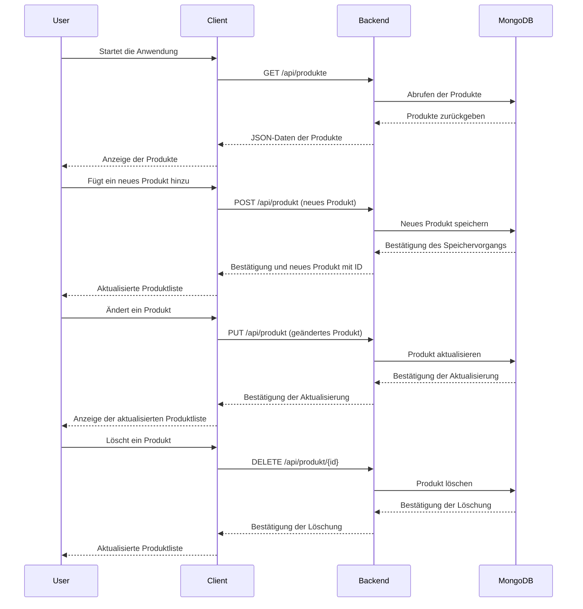

### Klassendiagramm WPF Client
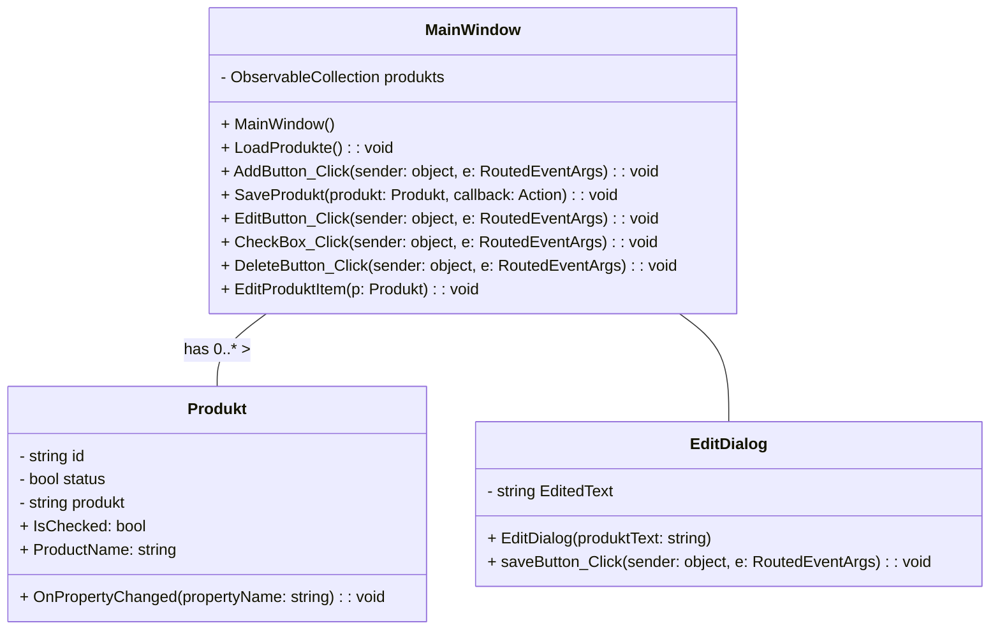

<br>

## Quellenverzeichnis

### Spring-Boot Server
#### [Spring-Boot]()
#### [JSON](https://www.json.org/json-en.html)

### WPF-Client
#### [C#](https://learn.microsoft.com/de-de/dotnet/csharp/)
#### [JSON](https://www.json.org/json-en.html)

### WebApp-Client
#### [HTML](https://developer.mozilla.org/en-US/docs/Web/HTML)
#### [CSS](https://developer.mozilla.org/en-US/docs/Web/CSS)
#### [JavaScript](https://developer.mozilla.org/en-US/docs/Web/JavaScript)
#### [JSON](https://www.json.org/json-en.html)

### MongoDB Datenbank
#### [MongoDB](https://www.mongodb.com/docs/)

### IDE & Nuggets
#### [WebStrom 2024.1.2](https://www.jetbrains.com/webstorm/download/download-thanks.html?platform=windows)
#### [IntelliJ IDEA 2024.1.1](https://www.jetbrains.com/idea/download/download-thanks.html?platform=windows)
   - ###### [Spring Boot Starter Data MongoDB 3.2.5](https://mvnrepository.com/artifact/org.springframework.boot/spring-boot-starter-data-mongodb/1.1.0.RELEASE)
   - ###### [Spring Boot Starter Web 3.2.5](https://mvnrepository.com/artifact/org.springframework.boot/spring-boot-starter-web)
#### [Visual Studio 2022 17.9.7](https://visualstudio.microsoft.com/de/thank-you-downloading-visual-studio/?sku=Community&channel=Release&version=VS2022&source=VSLandingPage&cid=2030&passive=false)
